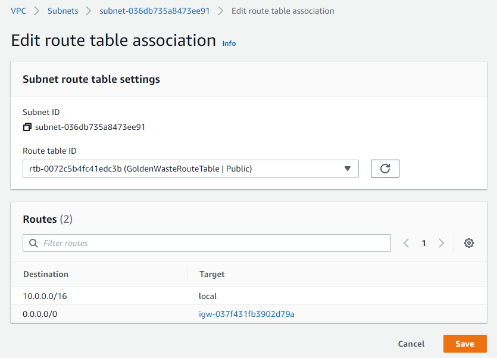

## Step1:

Creating three EC2 instances, one Ubuntu Linux server as a Master, one Ubuntu Linux web server and one Ubuntu Linux as a MySQL database using CloudFormation template.

**`GoldenWasteVPC.yml`**

**`aws cloudformation create-stack --stack-name GoldenWaste --template-body file://GoldenWasteVPC.yml`**

## Step2:

Connect into Master server using SSH protocol:

*Example:*
**`ssh -i "temp.pem" ubuntu@ec2-54-163-90-219.compute-1.amazonaws.com`**

## Step3:

Change the permissions of private SSH key to 400:

**`sudo chmod 400 /home/ubuntu/GoldenWaste/.ssh/temp.pem`**

## Step4:

Edit the inventory file with the new Private IPv4 addresses:

**`sudo vim /home/ubuntu/GoldenWaste/ansible/hosts/GoldenWasteHosts`**

## Step5:

**Temporary**, edit route table association for `GoldenWasteSubnetPrivate` subnet and apply `GoldenWasteRouteTable | Public` route table:

[Subnets | VPC Management Console (amazon.com)](https://us-east-1.console.aws.amazon.com/vpc/home?region=us-east-1#subnets:)

## Step6:

Run **`setup.yml`** playbook:

> **Note:**
>
> You can ping the hosts servers to test the connection status by putting this command:
>
> **`sudo ansible all -m ping -o -i /home/ubuntu/GoldenWaste/ansible/hosts/GoldenWasteHosts`**

**`sudo ansible-playbook /home/ubuntu/GoldenWaste/ansible/playbooks/setup.yml -i /home/ubuntu/GoldenWaste/ansible/hosts/GoldenWasteHosts`**

## Step7:

1. Go to Jenkins:
   `http://{MasterInstanceIP}:8080`
2. Run `sudo cat /var/lib/jenkins/secrets/initialAdminPassword` and copy the password (if you missed it from ansible playbook)
3. Go to SonarQube
   `http://{MasterInstanceIP}:9000`
4. Create local maven test
5. Update the Jenkinsfile
6. In Jenkins create a new pipeline item and choose the pipeline script from SCM and paste the repository URL
7. Start build pipeline

## Step8:

**`sudo ansible-playbook /home/ubuntu/GoldenWaste/ansible/playbooks/deploy.yml -i /home/ubuntu/GoldenWaste/ansible/hosts/GoldenWasteHosts`**